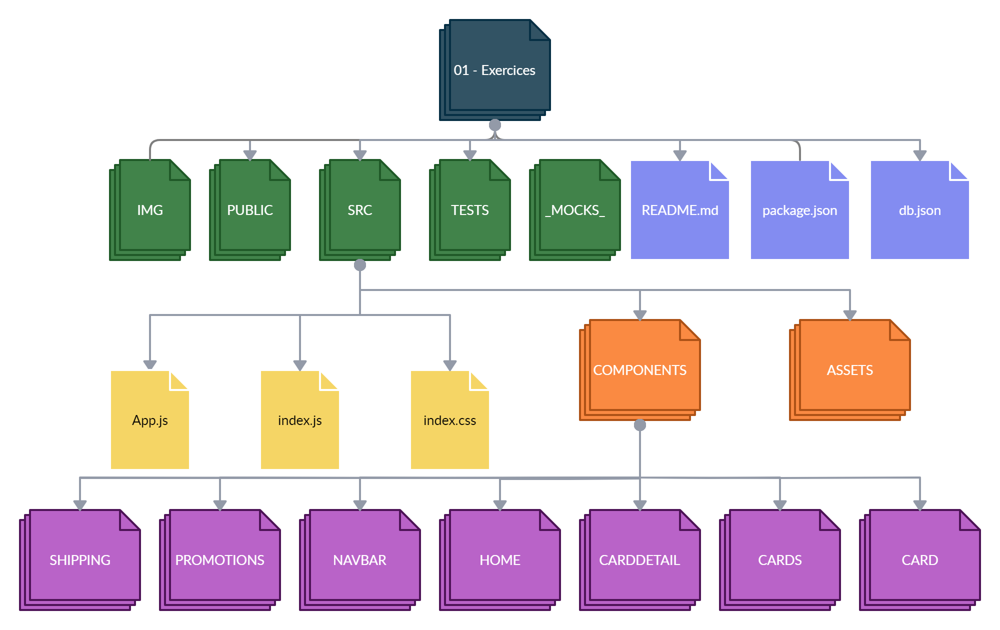

# React-Routing | Ejercicios

## **Durée estimée 🕒**

2 heures

<br />

---

## **INTRO**

Dans ces devoirs, vous trouverez l'application Cruise déjà structurée avec ses composants. Ce que vous devez faire, en fonction de ce que vous avez vu en classe, c'est router l'application.

<br />

---

## **CONSIGNATION**

- Implémenter les routes correspondantes pour restituer les composants de l'application.
- Effectuer des redirections vers d'autres composants.
- Conserver un composant rendu sur tous les itinéraires.

<br />

---

## **Étapes de base pour terminer les devoirs**

🔹 Pour exécuter les « tests » pour ces devoirs, nous devons ouvrir le terminal situé dans le dossier «  - Exercicereact4 ».

- Lorsque vous êtes dans ce dossier, vous devez exécuter la commande

```bash
npm install
```
- Prêt!! Vous pouvez maintenant exécuter les tests et lancer le projet avec les commandes :


🔹 Pour ces devoirs, vous devrez émuler des requêtes vers une API afin d'y consommer les données, pour ce faire, vous devez exécuter le serveur **db.json**, sans cette étape vous ne pourrez pas visualiser le résultat attendu et les tests ne passeront pas non plus. Voici les étapes pour exécuter le serveur :

- Ouvrir un deuxième terminal.
- Dans le terminal, allez dans le dossier sur lequel nous travaillons.
- Exécutez la commande :

```bash
npm run server
```

🔹 Pour visualiser l'application depuis le navigateur, vous devez ouvrir un troisième terminal et exécuter la commande :

```bash
npm start
```

En accédant à <http://localhost:3000> depuis votre navigateur, vous pouvez voir les résultats de notre travail en temps réel.

<br />

---

## **ESTRUCTURA**

🔹 Dans le dossier `ExerciseReact4`, vous trouverez la structure suivante :

- Un dossier appelé **_mocks_**
- Un dossier appelé **img**
- Un dossier appelé **public**
- Un dossier appelé `src` (Es la carpeta en donde trabajaremos)
- un fichier **db.json**
- un fichier **package.json**
- et le fichier `README.md` que vous lisez en ce moment. 🧐


En plus:

🔹 Dans le dossier `src`, vous trouverez le squelette du projet React, structuré comme suit :

- Un dossier appelé **assets**
- Un dossier appelé « composants »
- Un fichier appelé `App.js`
- Un fichier **index.css**
- Un fichier `index.js`

🔹 Pour ces exercices, nous travaillerons dans le dossier `components`, le fichier `App.js` et le fichier `index.js`. Dans le dossier **components**, vous trouverez :

- Un dossier appelé **Card**, qui contient à son tour :
  - Le composant `Card.jsx`
  - La feuille de style Card.module.css
- Un dossier appelé **CardDetail**, qui contient à son tour :
  - Le composant `CardDetail.jsx`
  - La feuille de style CardDetail.module.css
- Un dossier appelé **Cartes**, qui contient à son tour :
  - Le composant `Cards.jsx`
  - La feuille de style Cards.module.css
- Un dossier appelé **Accueil**, qui contient à son tour :
  - Le composant `Home.jsx`
- Un dossier appelé **NavBar**, qui contient à son tour :
  - Le composant `NavBar.jsx`
  - La feuille de style NavBar.module.css
- Un dossier appelé **Réductions**, qui contient à son tour :
  - Le composant `Discounts.jsx`
- Un dossier appelé **Expédition**, qui contient à son tour :

  - Le composant `Shipping.jsx`
  - La feuille de style Shipping.module.css

  

  <br />

---

## **👩‍💻 EXERCICE 1**

### **BrowserRouter**

🔹Ouvrez le fichier `index.js`, à l'intérieur vous trouverez :

- Le montant de :

  - **React**
  - **ReactDOM**
  - **index.css**
  - **App.js**

-Vous trouverez également les éléments de réaction de rendu ReactDOM dans le navigateur.

🔹 Que faire :

1. Importe `BrowserRouter` depuis **'react-router-dom'** et envelopper **App** ds le composant **_BrowserRouter_**.

   <br />

---

## **👩‍💻 EXERCICE 2**

### **Routing**

🔹 Accédez maintenant au composant App.js.

🔹 Ce qu'il faut faire:


1. Importez `Routes` et `Route` depuis **react-router-dom** et affichez le composant **Routes**.
2. Générez un composant **Route** à l'intérieur du composant **_Routes_** avec les attributs `path` et `element` pour chaque itinéraire que vous devez créer :

   - Home --> path: **"/"** element: `<Home/>`
   - Shipping --> path: **"/shipping"** element: `<Shipping/>`
   - Discounts --> path: **"/discounts"** element: `<Discounts/>`
   - CardDetail --> path: **"/cruises/:id"** element: `<CardDetail/>`

3. Vous avez également besoin que `NavBar` soit un itinéraire dynamique qui apparaît dans toute l'application, en le plaçant avant le composant Routes.

   <br />

---

## **👩‍💻 EXERCICE 3**

### **Links**

🔹 Créez maintenant des liens pour naviguer entre les itinéraires.

🔹 Que faire :

1. Dans le composant **_Card_** :


- Importez `Link` depuis **react-router-dom** et enveloppez le code dans le composant **Link** avec l'attribut to, où il pointe vers la route '\`/cruises/${id}`'.

2. Dans le composant **_CardDetail_** :

   - Importez `useParams` et `useNavigate` depuis **react-router-dom**
   - Obtient l'`id` de l'objet params (en utilisant la déstructuration) pour ensuite l'utiliser dynamiquement dans la route. Exemple:
   
     ```jsx
     const { id } = useParams();
     ```
     > Hint: N'oubliez pas que vous pouvez utiliser des accolades lorsque vous souhaitez inclure du code Javascript, dans ce cas, pour utiliser dynamiquement l'id.
   - Enregistrer dans une constante appelée `navigate` le hook **useNavigate**. Exemple:
     ```jsx
     const navigate = useNavigate();
     ```
  
   - Créez une fonction appelée `backToHome` dans laquelle vous exécutez **navigate** et redirigez vers le chemin `"/"`.
   - Au bouton contenant le texte « Retour », attribuez l'attribut **onClick** où la fonction **backToHome** créée est exécutée.


Dans le composant **_NavBar_** :

   - Importez `NavLink` depuis **react-router-dom**.
   - Affichez le composant **NavLink** avec l'attribut `to` qui redirige vers le chemin `"/"` qui encapsule la balise d'image.
   - Affichez le composant **NavLink** avec l'attribut `to` qui redirige vers la route `"/shipping"`, qui enveloppe la balise span avec le texte "Navieras".
   - Rend le composant **NavLink** avec les attributs suivants :

     - `to` qui redirige vers la route `"/discounts"`, qui encapsule la balise span "Promotions".

     - `className` cette propriété doit avoir une fonction attachée. Cette fonction reçoit un paramètre appelé « isActive » sous forme de déstructuration. Si le paramètre est **true**, la classe de cette propriété doit être `.active` sinon, `.disable`.


     
> Astuce : isActive sera vrai lorsque le lien à l'intérieur de « to » correspond à celui actuellement présent dans le navigateur.

> Pour cette instance, tous les tests doivent être réussis. ✅ 🏆

🔹 Résultat attendu :

<p align="center"></p>

   <br />

---
## **🧠 N'oubliez pas que...**

- Pour connecter notre application à l'URL du navigateur, vous devez rendre le routeur du navigateur autour de votre application.
- Routes génère un arbre de routes et c'est à partir de celui-ci que nous pouvons restituer les composants.
- Route représente un chemin dans l'arbre, il doit toujours aller avec ses attributs path et element.
- La différence entre Link et NavLink est que Link n'a pas de style particulier et NavLink met en évidence le lien actuel ou actif à l'aide de la fonction "isActive".😃
- useParams renvoie un objet avec les propriétés et la valeur des segments d'URL dynamiques.
- useNavigate renvoie une fonction qui permet la navigation programmatique dans l'application. 😃
<br />

---

## **🔎 Recursos adicionales**

- Documentation [**React Router - useNavigate**](https://reactrouter.com/en/v6.3.0/api#usenavigate)
- Documentation [**React Router - useParams**](https://reactrouter.com/en/v6.3.0/api#usesearchparams)

<br />


